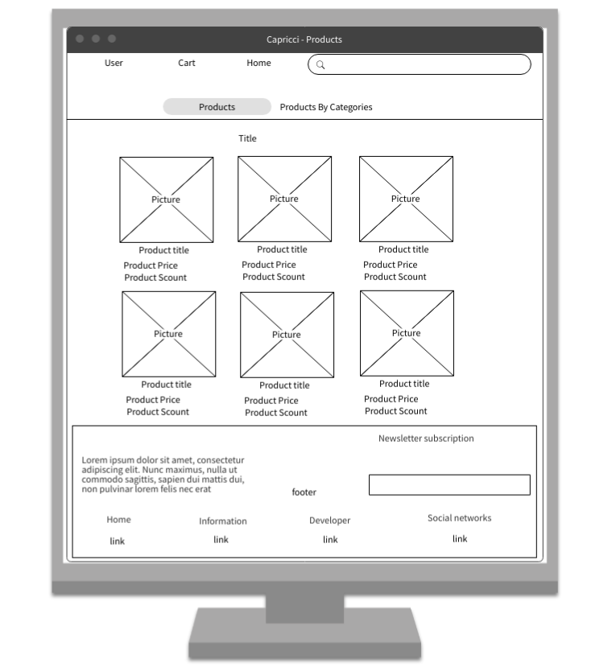
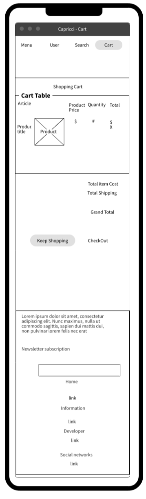
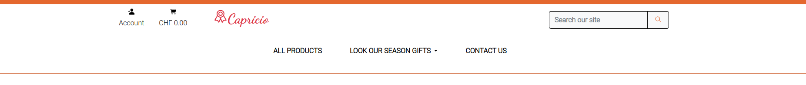
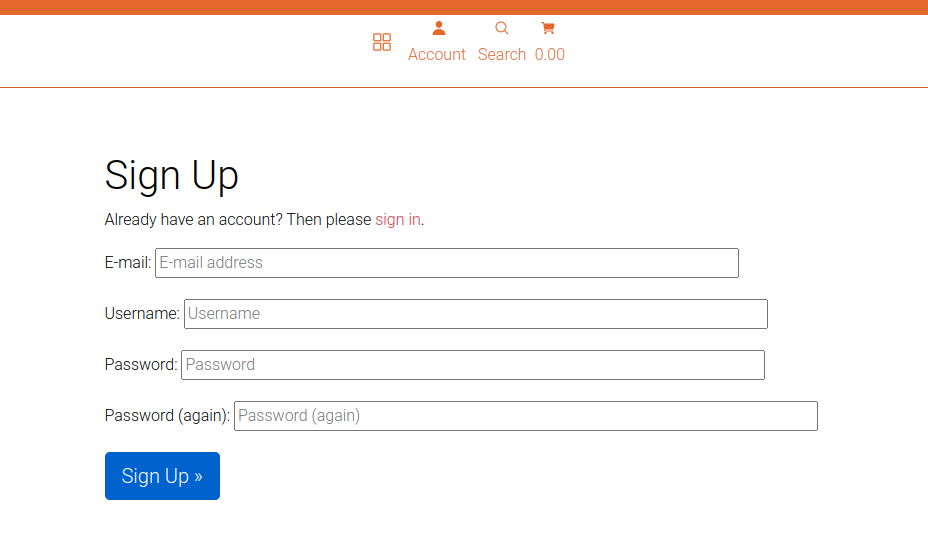
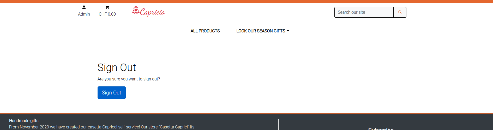
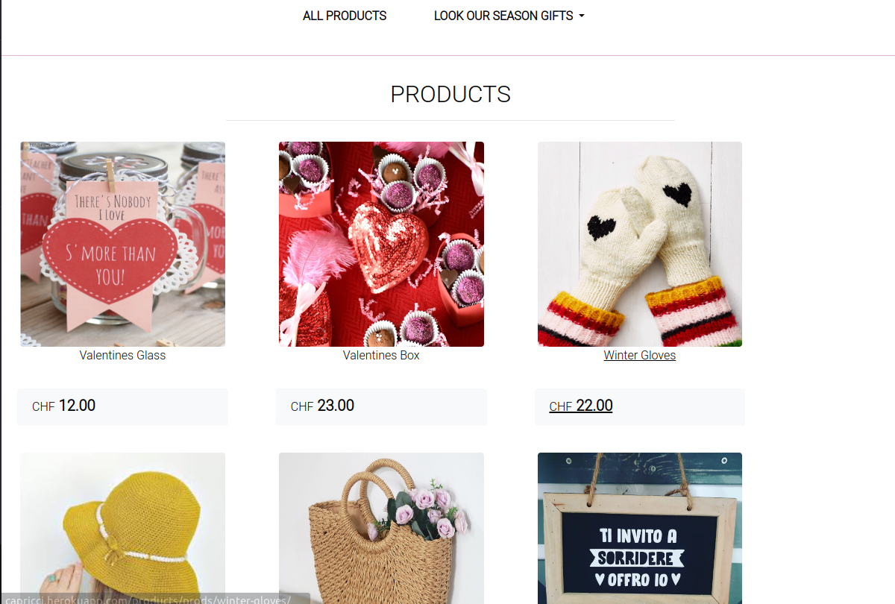
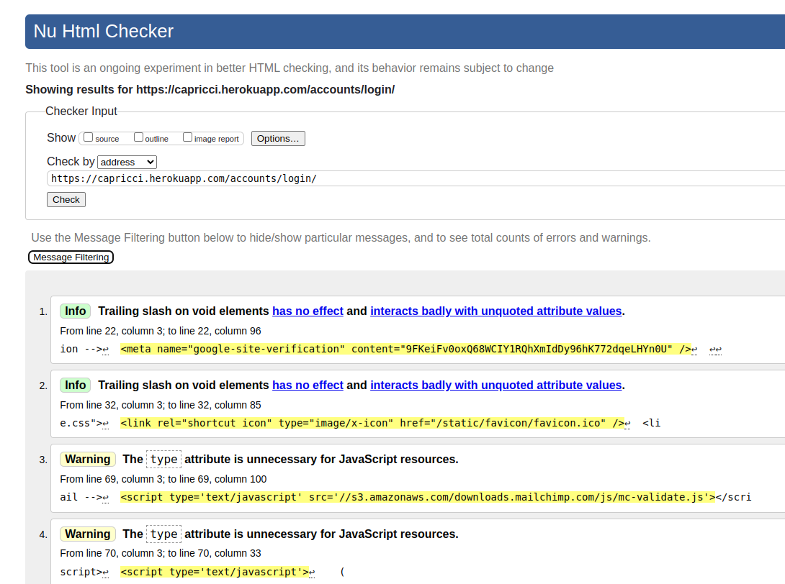
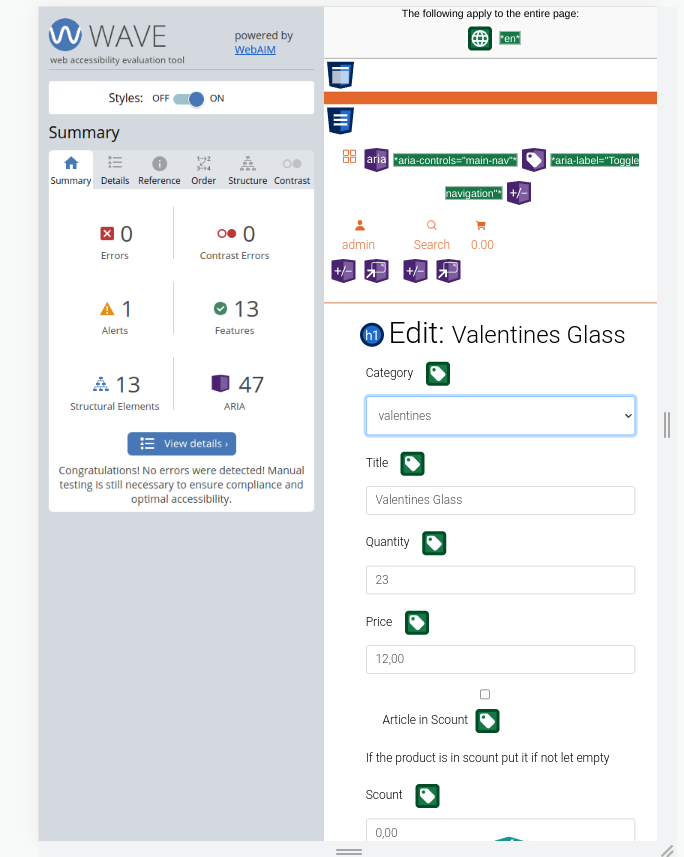
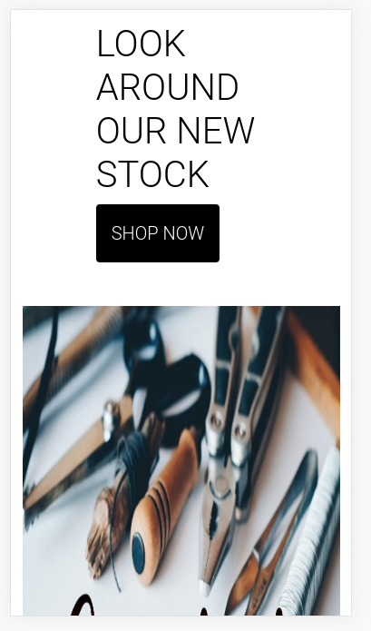

# Capricci Store

**Developer: Julio David Hernandez**

[Live Website](https://capricci.herokuapp.com/)


<hr>

## Table of Contents
  - [About](#about)
  - [Bussines Model](#bussines-model)
  - [Marketing](#marketing)
  - [User Goals](#user-goals)
  - [Site Owner Goals](#site-owner-goals)
  - [User Experience](#user-experience)
  - [User Stories](#user-stories)
  - [Design](#design)
    - [Colours](#colours)
    - [Fonts](#fonts)
    - [Structure](#structure)
      - [Website pages](#website-pages)
      - [Database](#database)
    - [Wireframes](#wireframes)
  - [Technologies Used](#technologies-used)
  - [Features](#features)
  - [Validation](#validation)
  - [Testing](#testing)
    - [Manual testing of user stories](#manual-testing-of-user-stories)
    - [Automated testing](#automated-testing)
    - [Performing tests on various devices](#performing-tests-on-various-devices)
    - [Browser compatibility](#browser-compatibility)
  - [Bugs](#bugs)
  - [Configuration](#configuration)
  - [Credits](#credits)
  - [License](#license)
  - [Acknowledgements](#acknowledgements)
<hr>

### About
<hr>

Handmade goods shop family concept to aid the local community's economy.

With two different kinds of accounts
- A regular user account 
- An administrator user account
##### Back to [top](#table-of-contents)

### Bussines model
<hr>
We sell our services to customers directly using the Business To Consumer (B2C) model.

We provide the option of personalized products in addition to our inventory of in-demand items. This reduces the possibility of demand fluctuations and helps us keep our business consistent.

#### -  Target Audience

- Those looking to give handmade items as gifts.
- Enthusiasts who want to promote local business.
- People who are searching gift ideas for the holidays for various goods.
- People who need to make a gift and do not have idea.
- People who want to gift a custom present.
- People looking for a season gift.

#### -  Competitors & alternatives

The potential competitors and alternatives are:

- The local Sellers (Being a little entrepreneur in the region are not many locals).
- The inferior quality of the factory-produced things.

#### - Costs & needs
Our costs and solutions are presented here.

- We made an investment in a small store building.
- The time needed to learn the methods.
- The Production of Stock (Depends on how big is).
- The price varies based on the economy as resources are always more expensive depending on the state of the world economy (Having around of, 3000CHF spent monthly).

#### - Vision & aims

Briefly describe our products' vision and long- and short-term goals.

- We want to always provide high-quality products, increase our inventory, and add new products like personalized surprices.
- Popularity in the area is our short-term goal, and expanding our store to new areas is our long-term objective.


#### Market Analysis:

Due to a growing awareness of the value of supporting local businesses and the quality of artisanal goods, the market for these goods is expanding. Like artisanal beer, wine, and other industries, this one has been expanding over time. Now that people are becoming aware of the benefits and the process for themselves , and is not the limit for example the hotels are requiring handcraft manufacturers to pruduce. 
 
Acording with the EMR (EXPERT MARKET RESEARCH) " The global handicrafts market stood at a value of USD 704.7 billion in 2022. The handicrafts market is projected to witness a CAGR of 11.8% over the forecast period of 2023-2028. It is expected to reach USD 1376.12 billion by 2028."


 The market for handicrafts is anticipated to increase by USD 514.92 billion between 2021 and 2025, with a CAGR of almost 13%.


### Marketing
<hr>

- Social media is a key component of our marketing strategy because it is the platform that receives the most traffic overall and is simple to access through influencer marketing or similar social media offerings.

- Facebook and Instagram are platforms where we can share our items.
- Share the video clips that go along with the explanation process.

[Facebook](https://www.facebook.com/people/Capricci/100089305256045)
[Instagram](https://www.instagram.com/capricci_nicole_joleine)

- Through the usage of Mail Chimp services, we obtained a mailing list that allowed us to easily create a client database and apply future plans, such as sending offers to our clients.

[MailChimp](https://mailchimp.com/es/)
##### Back to [top](#table-of-contents)

### User Goals
<hr>

- Use the site's navigation tools as needed 
- Purchase products from the stock 
- Pay attention to comments on individual items' descriptions
- The function for registered users to comment on specific items.

##### Back to [top](#table-of-contents)

### Site Owner Goals
<hr>

- Supply an online store for Local Users.
- An internet store where customers may purchase original gifts.
- Create a simple, aesthetically pleasing design.
- Provide full responsive application with comfortable navigation.
- Security payment method to make feel safe the user.
<hr>
##### Back to [top](#table-of-contents)

## User Experience
<hr>

### User Requirements and Expectations

- Practical site use.
- Fluent site navigation.
- Attractive design.
- Responsive Design by different screen size.
- A Responsive application that enables users to access the store from any platform.
- Simple methodology to be use the applications.
- Applications and Links working as hoped-for.
- Easy method to contact with the managers.


## User Stories
<hr>

### Users

Like user I want to:

1. Have a responsive Navigation Bar and home page.
2. Have a responsive Footer And networks.
3. Have a responsive view to Check cart content.
4. Purchase products by quantity.
5. Get the New Collection.
6. Check cart amount.
7. have a Search function.
8. Get own cart at any time.
9. Get own total at any time.
10. Get the offers and season products.
11. Have a View with the individual item details.
12. Get the Checkout details.
13. Get Checkout details by Email.
14. Bring the Payment details by Stripe Service. 
15. Get Recipe view with the Details.
16. Have a User Functionaity: Login, Logout, Register.
17. Confirm own Email by a email confirmation.
<hr>

### Site Owner

As a site Owner, I want to:

18. Add a product.
19. Delete product. 
20. Edit/Update product. 
21. Add a category. 
22. Delete category. 
23. Edit/update category. 
24. Error Pages.

##### Back to [top](#table-of-contents)

<hr>


## Design

### Colours

Using the W3schools color picker, the color tones were carefully selected to reflect the concept and create a straightforward and user-friendly design.
three hues used to create a fluid user experience design

<details><summary>Orange Color</summary>

</details>
<details><summary>Blue Color</summary>

</details>
<details><summary>Red Color</summary>

</details>
<details><summary>Color Picker</summary>

</details>

<hr>

### Fonts

ROBOTO and Dancing Font from GOOGLE. The most used on the majority of data flow.
<hr>

### Structure

#### Website pages


Following the principles of UXD (user experience design), the website structure was designed to be fluid and simple to operate. 
The website was composed of a page with:

  - The website consists of the following sections:
  - The Home page and some interactive pages.
  - The Products List.
  - The Product Details.
  - The Product Details with option to comment for Login Users.
  - Log In Page for register user.
  - Log out Page for login user.
  - Register Page for non login user.
  - Manager Page to Admin User to delete items.
  - Edit item page for Admin user.
  - Add item Page for Admin User.
  - Footer with social media and newsletter.
  - 403, 404, 500 error page.
<hr>

#### Database

- The backend consists in the use of Django framework based in python with a database of a Postgres Elephant SQL for the deployed version.

<details><summary>Database</summary>

</details>

- Consist in five database models, all fields are stored in the database structure stored in the database.
The following models represent the database model structure of the website:

<details><summary>Models Diagram</summary>

</details>

<hr>

##### User Model
- The User model is part of the Django allauth library and was represented as hypothetical.
<hr>

##### Product Model
- The Prod model is made in the following fields: category, title, title_slug, price, scount, quantity, featured_image, scountbool, description, created_on
- The model has a one-to-one relationship with Category
- The image field contains the Product Picture.

<details><summary>Product Model</summary>

</details>

<hr>

##### Category Model
- The Cat model is made in the following fields: author, title, slug, featured_image, created_on 
- The image field contains the Category Picture if is needed.

<details><summary>Category Model</summary>

</details>

<hr>

##### Order Model

- The Order model contains the fields: order_number, owner, full_name, email, phone_number, canton, city, postcode, street_address1, street_address2, date, delivery_cost, order_total, grand_total
- The model is contected with User if the order is done with login user.

<details><summary>Order Model</summary>

</details>

<hr>

##### Order Products

- The OrdProd model contains the following fields: order, product, quantity, prods_total.
- The model is contected with User if the order is done with login user.
- The model has a one-to-one relationship with the Order.
<details><summary>Order Products Model</summary>

</details>

<hr>

### Wireframes

<details><summary>Laptop & Desktop</summary>
  <details><summary>Home</summary>
  
  </details>
  
  <details><summary>Products</summary>
  
  </details>
  
  <details><summary>Product Details</summary>
  
  </details>

  <details><summary>Cart</summary>
  
  </details>

  <details><summary>Check</summary>
  
  </details>

  <details><summary>Payment</summary>
  
  </details>
  
  <details><summary>Manager Products</summary>
  
  </details>
  
  <details><summary>Manager Add/Edit</summary>
  
  </details>

  <details><summary>About Us</summary>
  
  </details>
</details>
<details><summary> Tablet & Smartphone </summary>

  <details><summary>Home</summary>
  
  </details>
  
  <details><summary>Products</summary>
  
  </details>
  
  <details><summary>Product Details</summary>
  
  </details>

  <details><summary>Cart</summary>
  
  </details>

  <details><summary>Check</summary>
  
  </details>

  <details><summary>Payment</summary>
  
  </details>
  
  <details><summary>Manager Products</summary>
  
  </details>
  
  <details><summary>Manager Add/Edit</summary>
  
  </details>

  <details><summary>About Us</summary>
  
  </details>
</details>

##### Back to [top](#table-of-contents)
<hr>

## Technologies Used
<hr>

### Languages & Frameworks

- HTML
- CSS
- Javascript
- Python
- Bootstrap
- Django

### Libraries & Tools

- asgiref==3.5.2
- dj-database-url==1.2.0
- dj3-cloudinary-storage==0.0.6
- Django==3.2.16
- django-allauth==0.51.0
- django-crispy-forms==1.14.0
- django-summernote==0.8.20.0
- gunicorn==20.1.0
- oauthlib==3.2.2
- Pillow==9.4.0
- psycopg2==2.9.5
- PyJWT==2.6.0
- python3-openid==3.2.0
- pytz==2022.6
- requests-oauthlib==1.3.1
- sqlparse==0.4.3
- stripe==5.0.0
- whitenoise==6.2.0
- [Git](https://git-scm.com/) To have a version control
- [GitHub](https://github.com/) To store The Git Data
- [Postgres SQL](https://www.elephantsql.com/) – The server service to Save Postgres SQL database
- [Cloudinary](https://cloudinary.com/) cloudinary-storage 1.30.0
- [Summernote](https://summernote.org/) To use Summerfield in forms
- [Visual Studio Code](https://code.visualstudio.com/) & [GitPod](https://www.gitpod.io/) To Edit and test the code.
- [Favicon.io](https://favicon.io) To Create the site's favicon.
- [Google Fonts](https://fonts.google.com/) To Use special fonts.
- [WireFrame](https://wireframepro.mockflow.com/) To Design the wireframes.
- [Dbdiagram.io](https://dbdiagram.io) To create the diagram Database.
- [Herooku](https://dashboard.heroku.com) To deploy the project online.
<hr>

- Validation:

  - [WC3 Validator](https://validator.w3.org/) to validate the html Files
  - [Jigsaw W3 Validator](https://jigsaw.w3.org/css-validator/) to validate the css Files
  - [Wave Validator](https://wave.webaim.org/) to check accessibility
  - [Lighthouse](https://developers.google.com/web/tools/lighthouse/) to check performance web apps
  - [JShint](https://jshint.com/) to validate JavaScript Files
  - Pylint Flake8 to check Python Files

##### Back to [top](#table-of-contents)

<hr>

## Features

<hr>

### Navigation Bar

- This Feature can be accessed at the all pages
- The nav bar includes links to Home, Search in the stock and cart view.

  - Search Function Can search Items by a key words.
  - The Cart is visible any time and the total amount inside of it.
  - Logged-in users will see their name right in the nav bar with option to click to log out
  - Not logged-in users have the option to register or log in.
  - Admin Users Have the option to Stock Manager.
- In Medium and big Screens Down of the Nav Bar you have the sections all products and filter by seasons

  <details><summary> View </summary>
  
  </details>

- In Small Screens you have the products and filter by seasons In menu a button.

  <details><summary>View</summary>
  
  </details>

- The nav bar have responsive design to change in small medium and large size screens.
- The navbar have down a filter Products can be filtered By seasons.

<details><summary>Home Page</summary>
  <details><summary>Midium and small Screen</summary>
  
  </details>
  <details><summary>Large Screen</summary>
  
  </details>
</details>

- User stories covered: 1, 6, 7, 8, 9, 10

<hr>

### Home page

- Home page is main view.
- Main page contains the actualy offers or new collections.
- User stories covered: 1, 5
<details><summary>Home Page</summary>
  <details><summary>Phone View</summary>
  
  </details>
  <details><summary>Laptop View</summary>
  
  </details>
</details>

<hr>

### Footer
- A footer is displayed in the base template, it is shows at bottom in each page.
- Contains network links to get in contact.
- Includes the subscription to the newsletter.
- User stories covered: 2

<details><summary>Footer</summary>
<details><summary>Laptop</summary>

</details>
<details><summary>Tablet</summary>

</details>
<details><summary>Phone</summary>

</details>
</details>

<hr>


### Users Functionality 
  when the users are log-in, log-out & sign-up will be notified by alert message.

- Sign up / Register

  1. Everyone can create an account.
  2. Confirm Register By email.
  3. User stories covered: 16, 17.

  <details><summary>Sign UP/ Register</summary>
    
    <details><summary>Small Screen</summary>
    
    </details>
    
    <details><summary>Mid-Big Screen</summary>
    
    </details>
  </details>

  <details><summary>Email Confirmation</summary>
  
  </details>

  <hr>

- Login / SignIn
  1. Only Sign Up users could log-in to their account.
  2. User and Password Fields are mandatory.
  3. When user is logged will be able to Comment the products.
  4. User stories covered: 16.

  <details><summary>Sign in</summary>
    
    <details><summary>Small Screen</summary>
    
    </details>
    
    <details><summary>Mid-Big Screen</summary>
    
    </details>

  </details>


  <hr>

- Sign Out
  1. Confirmation screen for Logged in user to logout from their account 
  2. User stories covered: 16.

  <details><summary>Sign Out</summary>
    
    <details><summary>Small Screen</summary>
    
    </details>
    
    <details><summary>Mid-Big Screen</summary>
    
    </details>

  </details>

<hr>

### Products
- List View
  - Clients can interact with the page clicking in the items to see more details.
  - The Client can see All the stock or filtered By keyword or seasons
  - The Client Can see The price, scount and tittle of the items.
  - User stories covered: 5, 10

  <details><summary>Products View</summary>

  <details><summary>Big Screen View</summary>
  
  </details>

  <details><summary>Small Screen View</summary>
  
  </details>

  </details>

<hr>

- Detailed view
  - Clients can get items by clicking the Quantity and adding to the cart.
  - The Client can get the description of the item selected, its includes Title, Price, discount, Description, quantity of desired items.
  <details><summary>Item Details</summary>
  
  </details>
  - The Client can see the Users Opinions about the specific item.

  - The Login users Can comment in the section.
  
    <details><summary>Comment</summary>
  
  </details>
  - User stories covered: 4, 5, 10, 11
<hr>

### Buy Process

#### Cart
- Clients can add The items to the cart by quantity needed.
- Clients can get the Cart view with the details of the order.
- Clients can go to the Checkout process.
- User stories covered: 3, 4.

#### CheckOut

- Clients can buy items by security process with stripe service.

<details><summary>Stripe</summary>

<details><summary>Some Payments</summary>
  
  </details>
  <details><summary>Payment Details</summary>
  
  </details>
</details>
- User stories covered: 14.

- Clients Can get a Checkout View with Form to fill with Delivery details. 
  
  <details><summary>Checkout Form</summary>
  
  </details>


- Clients can finish the checkout with a check view with the order details.
  <details><summary>Check Details</summary>
  
  </details>
  - User stories covered: 15.


- Client will be notified by email with ammount and order number.
  <details><summary>Check Details</summary>
  
  </details>
  - User stories covered: 13.


<hr>

### Stock Manager 
  - The Admin users are Able To Add, edit and delete a product of the stock .
  - The Admin users have a confortable view and easy to understand
    <details><summary>Manager View</summary>
    
    </details>
    
    <details><summary>Product Form</summary>
    
    </details>
  - User Stories covered: 18, 19, 20.

<hr>

### Error pages

- If the user has no premises to access, the 403-page will show
- If a user goes to no exist link, the error page will display 404
- If the user fills a form wrong,  will display error-500 page
- User stories covered: 24

<details><summary>Error page</summary>
  <details><summary>403</summary>
  
  </details>

  <details><summary>404</summary>
  
  </details>

  <details><summary>500</summary>
  
  </details>


</details>

##### Back to [top](#table-of-contents)
<hr>


## Validation

### HTML Valitadion
The W3C Markup Validation Service was used to validate the HTML of the website.

#### Base Structure

- <details><summary>Home</summary>
  
  </details>

- <details><summary>About us</summary>
  
  </details>

- <details><summary>Base Template</summary>
  The errors here are the django templates function the validator
  does not recognize them
  
  </details>

#### Products 
-  <details><summary>Products</summary>
   
   </details>

-  <details><summary>Products Details</summary>
   
   </details>

#### User Functionality

-  <details><summary>Log in</summary>
   
   </details>

-  <details><summary>Log out</summary>
   
   </details>

-  <details><summary>Sign Up</summary>
   
   </details>
#### Payment Process

- <details><summary>cart</summary>
  
  </details>

- <details><summary>check details</summary>
  
  </details>

- <details><summary>Payment</summary>
  
  </details>

#### Manager

- <details><summary>Main View</summary>
  The errors here are the django templates function the validator
  does not recognize them
  
  </details>
- <details><summary>Add Product</summary>
  The errors here are the django templates function the validator
  does not recognize them
  
  </details>
- <details><summary>Edit Product</summary>
  The errors here are the django templates function the validator
  does not recognize them
  
  </details>

#### Error Pages
-  <details><summary>403</summary>
   
   </details>
-  <details><summary>404</summary>
   
   </details>
-  <details><summary>500</summary>
   
   </details>
<hr>

### CSS Validation

The W3C Jigsaw CSS Validator Service validate the CSS of the website, it passed without errors.

<details><summary>W3C jigsaw </summary>

</details>

<hr>


### JavaScript Validation

JSHint Service was used to validate the Javascript files.
<details><summary> JSHint</summary>
  <details><summary> Stripe</summary>
  The Undefined Variables Here are because the jshint does not recognize
  the Jquery functions
  
  </details>
  <details><summary> Notifications</summary>
  
  </details>
</details>

<hr>

### Python Validation

To validate python was used two services Pylint, Flake8.

- Pylint 2.15.8 is a static code analyser for Python 2 or 3. The latest version supports Python 3.7.2 and above.

- Flake8 6.0.0 is a popular lint wrapper for python. Under the hood, it runs 

three other tools and combines their results: pep8 for checking style. pyflakes for checking syntax. mccabe for checking complexity.

- #### Home

  <details><summary> APPS</summary>
  
  </details>
  <details><summary> VIEWS</summary>
  
  </details>

- #### Errors

  <details><summary>APP</summary>
  
  </details>
  <details><summary> URLS</summary>
  
  </details>
  <details><summary>VIEWS</summary>
  
  </details>

- #### Cart

<details><summary> APPS</summary>

</details>
<details><summary> CONTEXT</summary>

</details>
<details><summary> URLS</summary>

</details>
<details><summary> VIEWS</summary>

</details>

- #### Manager

<details><summary> APPS</summary>

</details>
<details><summary> FORMS</summary>

</details>
<details><summary> URLS</summary>

</details>
<details><summary> VIEWS</summary>

</details>

- #### Home

<details><summary> ADMIN</summary>

</details>
<details><summary> APP</summary>

</details>
<details><summary> FORMS</summary>

</details>
<details><summary> VIEWS</summary>

</details>
<details><summary> MODELS</summary>

</details>
<details><summary> SIGNALS</summary>

</details>
<details><summary> URLS</summary>

</details>
<details><summary> VIEWS</summary>

</details>
<details><summary> WEB HOOK HANDLER</summary>


</details>


- #### Home
  <details><summary> Notifications</summary>
  
  </details>


<hr>

### Chrome Dev Tools Lighthouse

Lighthouse was used to test the performance, accessibility, best practice and SEO of the site.
Overall the results are very good for the 4 values.

<hr>

#### Desktop

<hr>

#### Mobile

<hr>

### Wave

The WAVE WebAIM web accessibility evaluation tool was used to test the websites accessibility.

<details><summary>Home Wave</summary>

</details>

<details><summary>About Us Wave</summary>

</details>

<details><summary>Products wave</summary>
  <details><summary>List</summary>
  
  </details>

  <details><summary>Details</summary>
  
  </details>

</details>

<details><summary>Cart wave</summary>
  <details><summary>List</summary>
  
</details>

</details>

<details><summary>Checkout process wave</summary>
  <details><summary>Checkout Form</summary>
  
  </details>

  <details><summary>Check</summary>
  
  </details>

</details>


<details><summary>Manager Stock wave</summary>
  <details><summary>Products List</summary>
  
  </details>

  <details><summary>Products Edit</summary>
  
  </details>
  
  <details><summary>Products Add</summary>
  
  </details>

  <details><summary>Category Edit</summary>
  
  </details>

  <details><summary>Category Add</summary>
  
  </details>

</details>

##### Back to [top](#table-of-contents)

<hr>

## Testing

The testing approach is as follows:
1. Manual testing of user stories
2. Automated testing
<hr>

### Manual testing of user stories

1. Have a responsive Navigation Bar and home page.

**Step** | **Expected Result** | **Actual Result**
------------ | ------------ | ------------ |
Navigate in the page | The Content be responsive in our three test screens | Works as expected |


<details><summary>Home</summary>
  <details><summary>Phonne</summary>
  
  </details>
  <details><summary>Tablet</summary>
  
  </details>
  <details><summary>Laptop</summary>
  
  </details>
</details>

<details><summary>Navigation Bar</summary>
  <details><summary>Phone</summary>
  
  </details>
  <details><summary>Tablet</summary>
  
  </details>
  <details><summary>Laptop</summary>
  
  </details>
</details>

2. Have a responsive Footer And networks.

**Step** | **Expected Result** | **Actual Result**
------------ | ------------ | ------------ |
Navigate to THE page | Responsive in different screens size | Works as expected |

<details><summary>Test</summary>
  <details><summary>Phone</summary>
  
  </details>
  <details><summary>Tablet</summary>
  
  </details>
  <details><summary>Laptop</summary>
  
  </details>
</details>


3. Have a responsive view to Check cart content.

**Step** | **Expected Result** | **Actual Result**
------------ | ------------ | ------------ |
Get the Cart View | Responsive View in different screen size | Works as expected |

<details><summary>Cart</summary>
  <details><summary>Phone</summary>
  
  </details>
  <details><summary>Tablet</summary>
  
  </details>
  <details><summary>Laptop</summary>
  
  </details>
</details>

4. Purchase products by quantity.

**Step** | **Expected Result** | **Actual Result**
------------ | ------------ | ------------ |
Add Products By different quantity | Change the products in the cart | Works as expected |

<details><summary>Add Items To cart</summary>


</details>

5. Get the New Collection.

**Step** | **Expected Result** | **Actual Result**
------------ | ------------ | ------------ |
Use the View | Get the new collections items view | Works as expected |

<details><summary>Responsive</summary>


</details>

6. Check cart amount.

**Step** | **Expected Result** | **Actual Result**
------------ | ------------ | ------------ |
Look The navigation bar shows the cart amount | Amount changes everytime that we add something | Works as expected |

<details><summary>Responsive</summary>


</details>

7. have a Search function.

**Step** | **Expected Result** | **Actual Result**
------------ | ------------ | ------------ |
Navigate to THE page | Responsive in different screens size | Works as expected |

<details><summary>Responsive</summary>

</details>

8. Get own cart at any time.

**Step** | **Expected Result** | **Actual Result**
------------ | ------------ | ------------ |
Navigate to THE page | Responsive in different screens size | Works as expected |

<details><summary>Responsive</summary>

</details>

9. Get own total at any time.

**Step** | **Expected Result** | **Actual Result**
------------ | ------------ | ------------ |
Navigate to THE page | Responsive in different screens size | Works as expected |

<details><summary>Responsive</summary>

</details>

10. Get the offers and season products.

**Step** | **Expected Result** | **Actual Result**
------------ | ------------ | ------------ |
Navigate to THE page | Responsive in different screens size | Works as expected |

<details><summary>Responsive</summary>

</details>

11. Have a View with the individual item details.

**Step** | **Expected Result** | **Actual Result**
------------ | ------------ | ------------ |
Navigate to THE page | Responsive in different screens size | Works as expected |

<details><summary>Responsive</summary>

</details>

12. Get the Checkout details.

**Step** | **Expected Result** | **Actual Result**
------------ | ------------ | ------------ |
DO | RESULT | Works as expected or not |

<details><summary>Responsive</summary>

</details>

13. Get Checkout details by Email.

**Step** | **Expected Result** | **Actual Result**
------------ | ------------ | ------------ |
DO | RESULT | Works as expected or not |

<details><summary>Responsive</summary>

</details>

14. Bring the Payment details by Stripe Service.

**Step** | **Expected Result** | **Actual Result**
------------ | ------------ | ------------ |
DO | RESULT | Works as expected or not |

<details><summary>Responsive</summary>

</details>

15. Get Recipe view with the Details.

**Step** | **Expected Result** | **Actual Result**
------------ | ------------ | ------------ |
DO | RESULT | Works as expected or not |

<details><summary>Responsive</summary>

</details>

16. Have a User Functionaity: Login, Logout, Register.

**Step** | **Expected Result** | **Actual Result**
------------ | ------------ | ------------ |
DO | RESULT | Works as expected or not |

<details><summary>Responsive</summary>

</details>

17. Confirm own Email by a email confirmation.

**Step** | **Expected Result** | **Actual Result**
------------ | ------------ | ------------ |
DO | RESULT | Works as expected or not |

<details><summary>Responsive</summary>

</details>

18. Add a product.

**Step** | **Expected Result** | **Actual Result**
------------ | ------------ | ------------ |
DO | RESULT | Works as expected or not |

<details><summary>Responsive</summary>

</details>

19. Delete product.

**Step** | **Expected Result** | **Actual Result**
------------ | ------------ | ------------ |
DO | RESULT | Works as expected or not |

<details><summary>Responsive</summary>

</details>

20. Edit/Update product.

**Step** | **Expected Result** | **Actual Result**
------------ | ------------ | ------------ |
DO | RESULT | Works as expected or not |

<details><summary>Responsive</summary>

</details>

21. Add a category. 

**Step** | **Expected Result** | **Actual Result**
------------ | ------------ | ------------ |
DO | RESULT | Works as expected or not |

<details><summary>Responsive</summary>

</details>

22. Delete category. 

**Step** | **Expected Result** | **Actual Result**
------------ | ------------ | ------------ |
DO | RESULT | Works as expected or not |

<details><summary>Responsive</summary>

</details>

23. Edit/update category. 

**Step** | **Expected Result** | **Actual Result**
------------ | ------------ | ------------ |
DO | RESULT | Works as expected or not |

<details><summary>Responsive</summary>

</details>

<hr>

### Automated testing

Automated testing was done using the Django's unit tests from a Python standard library module: unittest. The reports were produced using the coverage tool.

<hr>

### Performing tests on various devices

The website was tested using Google Chrome Developer Tools Toggle Device Toolbar to simulate viewports of different devices.

The website was tested on the following devices:
- Lenovo legion (Big Screen)
- Samsung Galaxy Tab S4 (Medium screen)
- Hawei p40 (Small screen)

<hr>

### Browser compatibility

| [](http://godban.github.io/browsers-support-badges/)<br/>IE / Edge | [](http://godban.github.io/browsers-support-badges/)<br/>Firefox | [](http://godban.github.io/browsers-support-badges/)<br/>Chrome | [](http://godban.github.io/browsers-support-badges/)<br/>Safari | [](http://godban.github.io/browsers-support-badges/)<br/>Opera |
| --------- | --------- | --------- | --------- | --------- |
| IE11, Edge| last 2 versions| last 2 versions| last 2 versions| last 2 versions

##### Back to [top](#table-of-contents)

<hr>

## Bugs

| **Bug** | **Fix** |
| ------- | ------- |
|   bug   | how fixed it |
|    bug    | how fixed it |
|         | |

##### Back to [top](#table-of-contents)
<hr>

## Configuration
<hr>

### Deploy Application 

<hr>

#### Create a Database

- Database Create an elephant SQL
- Go to Elephant SQL and crew a new instance.
- select a server
- Create Database
    <details>
    <summary>step1</summary>
    
    </details>
    <details>
    <summary>step2</summary>
    Fill the form and submit
    
    </details>
    <details>
    <summary>step3</summary>
    
    </details>
    <details>
    <summary>step4</summary>
    Push Create and finish it.
    
    </details>
- Get Database Environment Url
  <details><summary>Database URL</summary>
  
  </details>
<hr>

#### Cloudinary

Create a cloudinary Acount and get the environment Url
  <details><summary>Get Cloudinary environment variable</summary>
  
  </details>

<hr>

#### Config Django App

- Add installed App cloudinary.
- config static files with cloudinary.
  <details><summary>Create in the Env.py file.</summary>  </details>
- Create a procfile and add " web: gunicorn name_of_main_app.wsgi".
- collect statics in Django project.
- Generate requirements by freeze command.

<hr>

#### Heroku Deployment


1. Create an account in heroku.com
2. Create a new app, give it a distinctive name, and select your server location.
  - <details><summary>Create App</summary>  </details>
  - <details><summary>Select server</summary> 
    Give a name to the app and select a server location.
     </details>
3. Go to Heroku aplication deployment.
4. Select Deployment method and conect with GitHub.
  - <details><summary>Git hub</summary>  </details>
5. Go settings, select  buildpacks. For the project, chose 'python'.
  - <details><summary>Buildpacks</summary>  </details>
6.  Go to Config and Env vars set with the environment variables gotten in the previus steps inside the env.py
  - <details><summary>Config vars</summary> Add them in this Structure </details>

7. Choose the branch at the end of deployment section.
8. Await the app's construction. When everything is deployed, you will see the message "App was successfully deployed" and a "View" button that will lead you to your deployed link.
  - <details><summary>Deploy branch</summary>  </details>

<hr>

### Forking the GitHub Repository

1. Go to the GitHub repository https://github.com/jdhernandezS1/CI_PP5_E_COM
2. Click on Fork button in top right corner
3. You will then have a copy of the repository in your own GitHub account.

<hr>

### Clone the GitHub Repository

To clone the repository:
- In the Github repository
1. Locate the button __Code__ in the right uper corner. 
2. Chose between HTTPS, SSH, Github CLI or download zip.
3. Open Git Terminal (Bash).
4. Go to the directory where you want to cloned the file.
6. Use command Git clone and paste the URL.
```bash
git clone https://github.com/jdhernandezS1/CI_PP5_E_COM.git
```   
Online Repositorie view [link_to_page](https://github.com/jdhernandezS1/CI_PP5_E_COM)

##### Back to [top](#table-of-contents)

<hr>

## Credits

- Code institute 
- icons source : https://ionic.io/ionicons
- w3schools  
- freepng.es
- herokuapp
- GitHub

<hr>

### Images

Images Sources:
- fabicons
- freepng
- ionicons


##### Back to [top](#table-of-contents)
<hr>

## __License__

- CI_PP5_E_COM is an open source project by [CI_PP5_E_COM](https://github.com/jdhernandezS1/CI_PP5_E_COM) that is licensed under [OPS](https://opensource.org/).
- CI_PP5_E_COM reserves the right to change the license of future releases.

<hr>

## Acknowledgements

Cordially thanks to: 

- HashEm to bless me.
- My Family to support me.
- My mentor Mr Mohamed Shami.
- Code Institute Academy.
- Guys of Stack overflow.